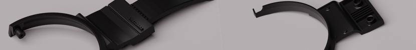

# RazerWing

Unfortunately or fortunately, recently my `Razer Kraken X Lite` headset wings broke. After a bit of research on the internet, I found out that this is a common problem. 

Many people like me have experienced the same issue. You can easily find information about it by searching "**razer kraken x lite broke**" on Google.

In this repository, I attempted to `reverse-engineer` the broken wings and create a 3D printed model to fix them using `FreeCAD`. 

I believe the result was good, but as of now, when I am writing this article, my 3D printed model is not yet ready.

## Disclaimer:
To anyone who uses this model, I should explain that I am not a professional `product designer`. You may encounter many issues such as `inaccuracies in size`. Please be aware that this design is just my first experience in product design and use it as your  risk :). 

Thank you @VHeidari :)

